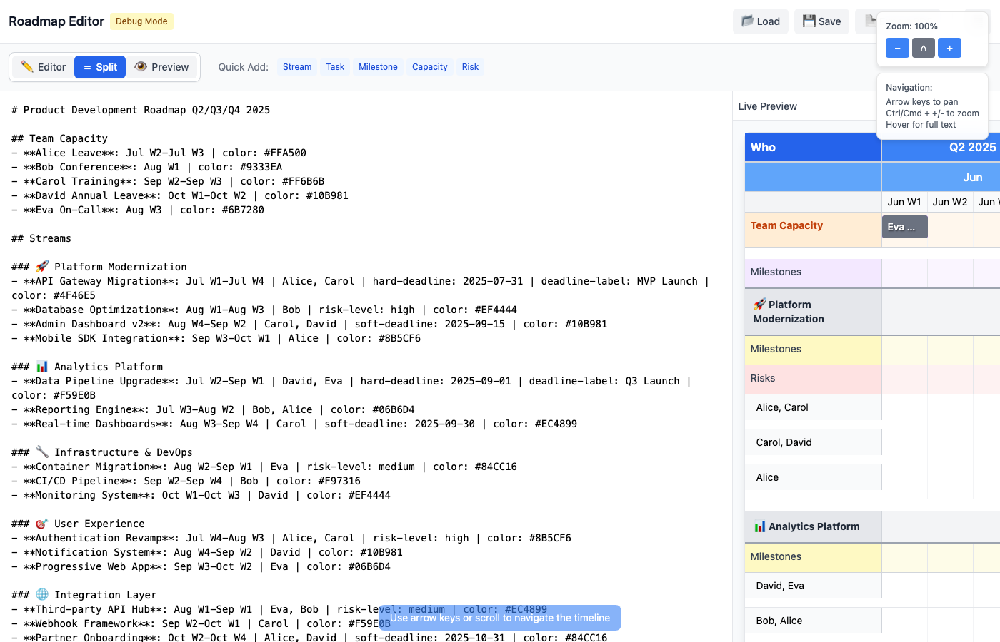
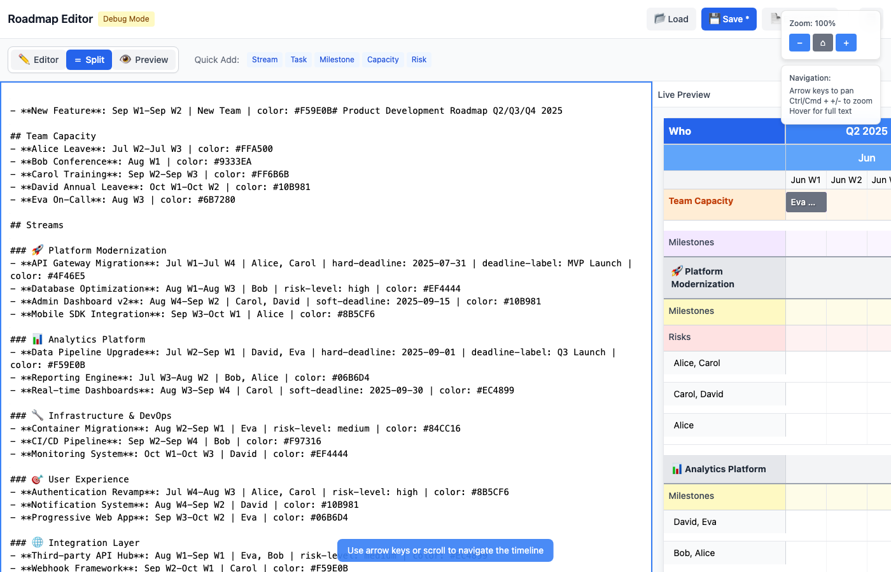

# Roadmap Planner

A **cross-platform** interactive roadmap and capacity planning tool with **live markdown editing**. Built with React and Tauri, available as both a web application and native desktop app for Windows, macOS, and Linux.


*Side-by-side markdown editor with real-time roadmap preview - edit on the left, see updates instantly on the right*


*Complete roadmap visualization showing project streams, team capacity, milestones, and risk tracking across multiple quarters*


*Live editing functionality - changes in the markdown immediately update the visual timeline*

> 📸 **Screenshots**: Run `pnpm screenshot` to generate updated screenshots showcasing the latest features

## 🎯 Platform Support

**🌐 Web Application**: Access anywhere through your browser with file download/upload
**🖥️ Desktop Application**: Native app with full file system access and enhanced performance
- **Windows**: `.msi` installer with auto-updater support
- **macOS**: Universal binary (Intel + Apple Silicon) with code signing
- **Linux**: `.deb` and `.AppImage` packages

## ✨ Key Features

### 📝 Live Markdown Editor
- **Side-by-Side Interface**: Edit markdown on the left, see roadmap updates instantly on the right
- **Real-Time Preview**: Changes appear immediately as you type - no save/refresh needed
- **Template System**: Quick-insert buttons for streams, projects, milestones, capacity, and risks
- **Syntax Validation**: Real-time error checking with helpful suggestions and line-by-line feedback
- **Full-Screen Editing**: Distraction-free markdown editing mode with syntax highlighting

### 🎯 Roadmap Visualization  
- **Interactive Timeline**: Pan and zoom through your roadmap with smooth performance
- **Adaptive Granularity**: Automatic daily/weekly/quarterly views based on date ranges
- **Team Capacity Planning**: Visualise leave, holidays, and resource constraints overlaid on timelines
- **Risk Management**: Track and display project risks with color-coded severity levels
- **Milestone Tracking**: Hard and soft deadlines with custom labels and visual indicators
- **Responsive Design**: Optimised for desktop, tablet, and mobile viewing

### 💾 File Operations & Export
- **Universal File Support**: Load any markdown file from your computer or web
- **Auto-Save**: Never lose your work with automatic saving as you edit
- **Professional Export**: Generate high-quality PDF reports and PNG screenshots
- **Native Integration**: Desktop app with OS-native file dialogs and keyboard shortcuts
- **Cross-Platform**: Identical features on Windows, macOS, Linux, and web browsers

## 🚀 Quick Start

### Prerequisites

- **Node.js** 18+ and **pnpm** (for both web and desktop development)
- **Rust** 1.70+ (for desktop app development only)

### Web Development

```bash
# Install dependencies
pnpm install

# Start web development server
pnpm dev

# Build for web deployment
pnpm build
```

> **💡 Development Note**: The default roadmap (`src/data/roadmap.md`) uses the complex example to showcase all features during development. This provides a comprehensive reference for testing and feature validation.

### Desktop Development

```bash
# Install dependencies (includes Tauri)
pnpm install

# Start desktop app in development mode
pnpm tauri:dev

# Build desktop app for distribution
pnpm tauri:build
```

### First-Time Desktop Setup

Install Rust if you haven't already:
```bash
# Install Rust
curl --proto '=https' --tlsv1.2 -sSf https://sh.rustup.rs | sh

# Restart your terminal, then verify
rustc --version
```

## 📊 Data Format

The roadmap uses a simple markdown-like format stored in `src/data/roadmap.md`:

```markdown
# Q3/Q4 2025 Product Roadmap

## Team Capacity
- **Developer Leave**: Aug W2-Aug W3 | color: #FFA500

## Streams

### Mobile Platform
- **Risk: iOS compatibility**: Aug W2-Aug W4 | risk-level: high | color: #FF4444
- **Mobile App v3.0**: Jul W1-Sep W2 | Mobile Team | hard-deadline: 2025-08-15 | deadline-label: App Release | color: #4F46E5
```

## 📋 Roadmap Examples

### Simple Roadmap

Perfect for getting started - shows basic projects and milestones:

```markdown
# My Product Roadmap - Q3 2025

## Streams

### Frontend Team
- **User Dashboard**: Jul W1-Aug W2 | Frontend Team | color: #3B82F6
- **Mobile Responsive**: Aug W3-Sep W1 | Frontend Team | color: #06B6D4

### Backend Team
- **API v2.0**: Jul W2-Aug W4 | Backend Team | color: #10B981
- **Database Migration**: Sep W1-Sep W3 | Backend Team | color: #8B5CF6

### Milestones
- **Beta Release**: Aug W4 | hard-deadline: 2025-08-25 | color: #EF4444
```

### Complex Roadmap

Showcases all features - team capacity, risks, multiple deadline types, and detailed planning:

```markdown
# Enterprise Platform Roadmap - Q3/Q4 2025

## Team Capacity
- **Alex Annual Leave**: Jul W3-Jul W4 | color: #FFA500
- **Jordan Conference**: Aug W2-Aug W2 | color: #FF6B6B
- **Taylor Training**: Sep W1-Sep W2 | color: #9B59B6
- **Summer Holidays**: Aug W1-Aug W3 | color: #FFB84D
- **Q4 Planning Week**: Oct W1-Oct W1 | color: #A78BFA

## Streams

### Mobile Platform
- **Risk: iOS 17 Compatibility**: Jul W1-Jul W3 | risk-level: high | color: #DC2626
- **Mobile App v3.0**: Jul W1-Sep W2 | Mobile Team (4 devs) | hard-deadline: 2025-09-15 | deadline-label: App Store Release | color: #4F46E5
- **Push Notifications**: Aug W1-Aug W4 | Mobile Team | color: #7C3AED
- **Offline Sync**: Sep W3-Oct W2 | Mobile Team | soft-deadline: 2025-10-15 | deadline-label: V3.1 Release | color: #5B21B6

### Analytics Platform
- **Real-time Dashboard**: Jul W2-Aug W3 | Analytics Team (3 devs) | color: #059669
- **Custom Reports Engine**: Aug W4-Oct W1 | Analytics Team | color: #047857
- **Risk: Data Privacy Compliance**: Sep W1-Sep W4 | risk-level: medium | color: #F59E0B
- **Advanced Analytics**: Oct W2-Nov W2 | Analytics Team | color: #065F46

### Infrastructure
- **Cloud Migration**: Jul W1-Sep W4 | DevOps Team (2 devs) | color: #DC2626
- **Risk: Migration Downtime**: Aug W2-Aug W3 | risk-level: high | color: #991B1B
- **Auto-scaling Setup**: Oct W1-Oct W4 | DevOps Team | color: #B91C1C
- **Security Audit**: Nov W1-Nov W2 | Security Team | hard-deadline: 2025-11-15 | deadline-label: Compliance Deadline | color: #7F1D1D

### Product Strategy
- **Market Research**: Jul W1-Jul W4 | Product Team | color: #2563EB
- **User Testing**: Aug W1-Aug W2 | Product Team | color: #1D4ED8
- **Feature Prioritisation**: Aug W3-Aug W4 | Product Team | color: #1E40AF
- **Q1 2026 Planning**: Oct W3-Nov W1 | Product Team | soft-deadline: 2025-11-01 | deadline-label: Board Presentation | color: #1E3A8A

### Milestones
- **Alpha Release**: Aug W1 | hard-deadline: 2025-08-01 | deadline-label: Internal Testing | color: #F59E0B
- **Beta Release**: Sep W1 | hard-deadline: 2025-09-01 | deadline-label: Customer Preview | color: #EAB308
- **Production Release**: Oct W1 | hard-deadline: 2025-10-01 | deadline-label: General Availability | color: #059669
- **Post-launch Review**: Nov W1 | soft-deadline: 2025-11-01 | deadline-label: Lessons Learned | color: #0891B2
```

### Key Features Demonstrated

**Simple Roadmap shows:**
- Basic project streams and timelines
- Team assignments
- Simple milestone tracking
- Clean color coding

**Complex Roadmap shows:**
- **Team Capacity Planning**: Leave, conferences, training, holidays
- **Risk Management**: High/medium risk items with visual indicators
- **Multiple Deadline Types**: Hard deadlines (must-hit) vs soft deadlines (target dates)
- **Custom Labels**: Descriptive deadline labels for context
- **Team Information**: Team names and sizes for resource planning
- **Comprehensive Milestones**: Different types of releases and reviews
- **Advanced Color Coding**: Strategic use of colors for visual grouping

### Supported Properties

- **Timeline**: `Jul W1-Sep W2` (week ranges) or `2025-07-15 to 2025-07-25` (daily ranges)
- **Teams**: Any text describing who's working on it
- **Colours**: Hex colour codes for visual differentiation
- **Deadlines**: `hard-deadline` or `soft-deadline` with ISO dates
- **Risks**: `risk-level: high|medium|low`
- **Labels**: Custom `deadline-label` for milestone annotations
- **Team Capacity**: Leave, conferences, training with date ranges and colors

## ✏️ Editing Experience

### Live Preview
The markdown editor provides instant feedback as you type. Changes appear in the roadmap visualization immediately - no save button required. This makes it easy to experiment with different layouts, colors, and timeline arrangements.

### Template Shortcuts
Quick-insert buttons help you add common elements:
- **Add Stream**: Creates a new project stream with sample tasks
- **Add Capacity**: Inserts team member leave or availability  
- **Add Milestone**: Creates deadline markers with customizable labels
- **Add Risk**: Adds risk tracking with severity levels

### Syntax Assistance
The editor provides real-time validation:
- **Error Highlighting**: Invalid date formats or missing properties are highlighted
- **Auto-Completion**: Common date patterns and property names are suggested
- **Helpful Messages**: Clear error messages explain how to fix syntax issues
- **Color Preview**: Hex color codes show a preview swatch

### Workflow Integration
- **Draft Mode**: Edit freely without affecting saved files
- **Auto-Save**: Changes are preserved automatically in browser/desktop app
- **Export on Demand**: Generate PDFs and screenshots any time during editing
- **Keyboard Shortcuts**: Standard shortcuts work (Ctrl/Cmd+S, Ctrl/Cmd+O, etc.)

## 📄 Export & File Management

### PDF Export (Web & Desktop)

Generate high-quality PDFs for sharing and printing:

#### Initial Setup (Web Only)
```bash
# Allow Puppeteer build scripts (one-time setup)
pnpm approve-builds

# Or install Chrome manually
npx puppeteer browsers install chrome
```

#### Generate PDFs
```bash
# Standard A4 portrait
pnpm pdf

# Landscape orientation (recommended for roadmaps)
pnpm pdf:landscape

# Large format for detailed roadmaps
pnpm pdf:a3
```

### Desktop File Operations

The desktop app provides native file management:

- **Open**: `Ctrl/Cmd + O` - Open roadmap files from your computer
- **Save**: `Ctrl/Cmd + S` - Save current roadmap
- **Save As**: `Ctrl/Cmd + Shift + S` - Save with new filename
- **Export**: Built-in PDF generation with native save dialogs

### Screenshot Generation

Generate updated screenshots showcasing the latest features:

```bash
# Generate comprehensive screenshot suite
pnpm screenshot

# Generate specific example screenshots  
pnpm screenshot:examples
```

**What gets captured:**
- **Web Editor View**: Side-by-side markdown editor with live preview
- **Full Roadmap View**: Complete timeline with all features visible
- **Editing in Action**: Live editing functionality demonstration  
- **Mobile Responsive**: Tablet and mobile layouts
- **Timeline Details**: Zoomed views showing granular detail
- **Simple Examples**: Getting started screenshots

**Desktop Screenshots:**
1. Build desktop app: `pnpm tauri:build`
2. Launch the built application  
3. Use system screenshot tools to capture native interface
4. Save to `docs/screenshots/desktop-*.png`

## 🎮 Controls & Navigation

### Universal Controls
- **Mouse**: Scroll to pan, zoom controls in UI
- **Keyboard**: Arrow keys to pan, `Ctrl/Cmd + +/-` to zoom
- **Touch**: Pinch to zoom, swipe to pan (mobile/tablet)

### Desktop-Specific Shortcuts
- **File Operations**: Standard OS shortcuts (`Ctrl/Cmd + O/S/N`)
- **Window Management**: Native window controls and full-screen support
- **Performance**: Hardware-accelerated rendering

## 🏗️ Architecture

### Technology Stack
- **Frontend**: React 18.3 + Vite + Tailwind CSS
- **Desktop Backend**: Rust + Tauri 1.5
- **Testing**: Vitest + Testing Library
- **Build**: Vite (web) + Tauri CLI (desktop)

### Project Structure
```
├── src/                    # React application source
│   ├── components/         # UI components
│   ├── domain/            # Business logic and parsing
│   ├── data/              # Roadmap data and configuration
│   ├── hooks/             # Custom React hooks
│   └── styles/            # Global CSS and Tailwind
├── src-tauri/             # Tauri desktop backend
│   ├── src/               # Rust source code
│   ├── icons/             # Application icons
│   ├── Cargo.toml         # Rust dependencies
│   └── tauri.conf.json    # Desktop app configuration
├── scripts/               # Build and utility scripts
├── docs/                  # Documentation and assets
└── dist/                  # Built application
```

### Key Components

- **RoadmapPlanner**: Main orchestrating component
- **StreamContainer**: Manages individual project streams
- **TimelineHeader**: Quarter/month/week navigation
- **TeamCapacity**: Resource and availability planning
- **NavigationControls**: Zoom, export, and keyboard shortcuts

## 🧪 Testing

```bash
# Run all tests
pnpm test

# Run with UI
pnpm test:ui

# Coverage report
pnpm test:coverage

# Test desktop app compilation
pnpm tauri:dev --no-run
```

## 🚀 Deployment

### Web Deployment

```bash
# Build for web
pnpm build

# Deploy to static hosting
# - Netlify: Drag dist/ folder or connect Git
# - Vercel: Import project or use CLI
# - GitHub Pages: Use dist/ folder
```

### Desktop Distribution

```bash
# Build for current platform
pnpm tauri:build

# Cross-platform builds (advanced)
pnpm tauri:build --target x86_64-pc-windows-msvc
pnpm tauri:build --target aarch64-apple-darwin
```

#### Distribution Files

After building, find your installers in `src-tauri/target/release/bundle/`:

- **Windows**: `.msi` installer + portable `.exe`
- **macOS**: `.dmg` disk image + `.app` bundle
- **Linux**: `.deb` package + `.AppImage` portable

### Docker (Web Only)

```dockerfile
FROM node:18-alpine
WORKDIR /app
COPY package.json pnpm-lock.yaml ./
RUN corepack enable && pnpm install --frozen-lockfile --prod
COPY . .
RUN pnpm build
EXPOSE 3000
CMD ["pnpm", "preview"]
```

## 🎨 Customisation

### Data Customisation

Edit `src/data/roadmap.md` to customise your roadmap:

```markdown
# Your Roadmap Title

## Streams

### Your Stream Name
- **Your Project**: Jul W1-Sep W2 | Your Team | color: #10B981
- **Another Project**: Aug W1-Oct W2 | Another Team | color: #EF4444
```

### Styling Customisation

Update `tailwind.config.js` for brand customisation:

```javascript
theme: {
  extend: {
    colors: {
      'brand-primary': '#your-color',
      'brand-secondary': '#your-color',
    },
  },
},
```

### Desktop App Customisation

Edit `src-tauri/tauri.conf.json`:

```json
{
  "package": {
    "productName": "Your Roadmap Tool",
    "version": "1.0.0"
  },
  "tauri": {
    "windows": [{
      "title": "Your Custom Title",
      "width": 1400,
      "height": 900
    }]
  }
}
```

## 🛠️ Development Commands

### Web Development
```bash
pnpm dev              # Start development server
pnpm build            # Build for production
pnpm preview          # Preview production build
pnpm test             # Run tests
```

### Desktop Development
```bash
pnpm tauri:dev        # Start desktop app in dev mode
pnpm tauri:build      # Build desktop app for distribution
pnpm tauri:icon       # Generate app icons from source image
pnpm tauri            # Access Tauri CLI directly
```

### Utility Commands
```bash
pnpm screenshot          # Generate comprehensive screenshot suite (NEW!)
pnpm screenshot:examples # Generate roadmap example screenshots  
pnpm pdf                 # Generate PDF export
pnpm lint                # Run ESLint
pnpm test:coverage       # Run tests with coverage
pnpm check               # Run build + lint validation
```

## 🤝 Contributing

1. Fork the repository
2. Create a feature branch (`git checkout -b feature/amazing-feature`)
3. Follow the existing code style and testing patterns
4. Test both web and desktop versions:
   ```bash
   # Test web version
   pnpm dev

   # Test desktop version
   pnmp tauri:dev
   ```
5. Update documentation and generate screenshots:
   ```bash
   # Generate comprehensive screenshot suite
   pnmp screenshot
   
   # See docs/SCREENSHOTS.md for desktop screenshot guide
   ```
6. Commit your changes (`git commit -m 'feat: add amazing feature'`)
7. Push to the branch (`git push origin feature/amazing-feature`)
8. Open a Pull Request

### Development Guidelines
- **Follow clean code principles**: See [CODING_STANDARDS.md](CODING_STANDARDS.md) for detailed guidelines
- **Screenshots**: Use `pnmp screenshot` to generate updated web screenshots. See [docs/SCREENSHOTS.md](docs/SCREENSHOTS.md) for desktop screenshots
- **No magic numbers**: Use named constants for all numeric values
- **Test-first approach**: Write failing tests before implementing features
- **Single responsibility**: Keep functions focused and cohesive

## 📋 Requirements

### For Web Development
- Node.js 18+
- pnpm package manager

### For Desktop Development
- Everything above, plus:
- Rust 1.70+
- Platform-specific build tools:
  - **Windows**: Microsoft C++ Build Tools
  - **macOS**: Xcode Command Line Tools
  - **Linux**: `build-essential` package

### For Cross-Platform Building
- Docker (optional, for Linux builds on other platforms)
- Platform-specific SDKs for signing and notarisation

## 📄 License

MIT License - see [LICENSE](LICENSE) file for details.

## 🙏 Acknowledgments

- Built with [React](https://react.dev/) and [Tauri](https://tauri.app/)
- Styled with [Tailwind CSS](https://tailwindcss.com/)
- Desktop functionality powered by [Rust](https://rust-lang.org/)
- Inspired by modern project management tools

---

## 📧 Support

- **Issues**: [GitHub Issues](https://github.com/your-username/roadmap-planner/issues)
- **Discussions**: [GitHub Discussions](https://github.com/your-username/roadmap-planner/discussions)
- **Documentation**: [Wiki](https://github.com/your-username/roadmap-planner/wiki)
- **Releases**: See [RELEASES.md](docs/RELEASES.md) for release process

## 📦 Downloads

**Latest Release**: [Download for your platform](https://github.com/your-username/roadmap-planner/releases/latest)

- 🍎 **macOS**: Download `.dmg` installer
  - **⚠️ Security Warning**: You'll see "damaged" or "unidentified developer" warnings
  - **📋 [Detailed Installation Guide](docs/MACOS_INSTALLATION.md)** - Step-by-step troubleshooting
- 🪟 **Windows**: Download `.msi` installer
- 🐧 **Linux**: Download `.AppImage` or `.deb` package

### 🍎 macOS Installation (Detailed Steps)

The app will trigger macOS security warnings because it's not signed with an Apple Developer certificate. Here are **three methods** to install it safely:

#### Method 1: Complete Quarantine Removal (Most Effective for "Damaged" Error)
1. Download the `.dmg` file
2. Open **Terminal** and run these commands:
   ```bash
   cd ~/Downloads
   sudo xattr -r -d com.apple.quarantine team-roadmap-planner*.dmg
   open team-roadmap-planner*.dmg
   sudo xattr -r -d com.apple.quarantine "/Volumes/Roadmap Planner/Roadmap Planner.app"
   cp -R "/Volumes/Roadmap Planner/Roadmap Planner.app" /Applications/
   sudo xattr -r -d com.apple.quarantine "/Applications/Roadmap Planner.app"
   ```

#### Method 2: Temporarily Disable Gatekeeper
1. Open **Terminal** and run: `sudo spctl --master-disable`
2. Install the app normally (double-click .dmg)
3. Re-enable: `sudo spctl --master-enable`

#### Method 3: System Preferences Override
1. Try to open the `.dmg` file (it will be blocked)
2. Go to **System Preferences** → **Security & Privacy** → **General**
3. Look for "Open Anyway" button and click it

#### If None of These Work:
1. Open **Terminal**
2. Run: `sudo spctl --master-disable` (temporarily disables Gatekeeper)
3. Install the app normally
4. Run: `sudo spctl --master-enable` (re-enables Gatekeeper)
5. **Warning**: Only do this temporarily and re-enable immediately after installation

#### Still Having Issues?
Try this terminal command after downloading:
```bash
# Remove quarantine from the downloaded file
xattr -d com.apple.quarantine ~/Downloads/team-roadmap-planner*.dmg

# If that doesn't work, try this more comprehensive removal:
sudo xattr -r -d com.apple.quarantine ~/Downloads/team-roadmap-planner*.dmg
```

> **Why these warnings?** The app isn't code-signed with an Apple Developer certificate ($99/year). The app is completely safe - this is just macOS being protective of unsigned applications.

**Choose Your Platform**: 🌐 [**Try Web Version**](https://your-demo-url.com) | 🖥️ [**Download Desktop App**](https://github.com/your-username/roadmap-planner/releases)
