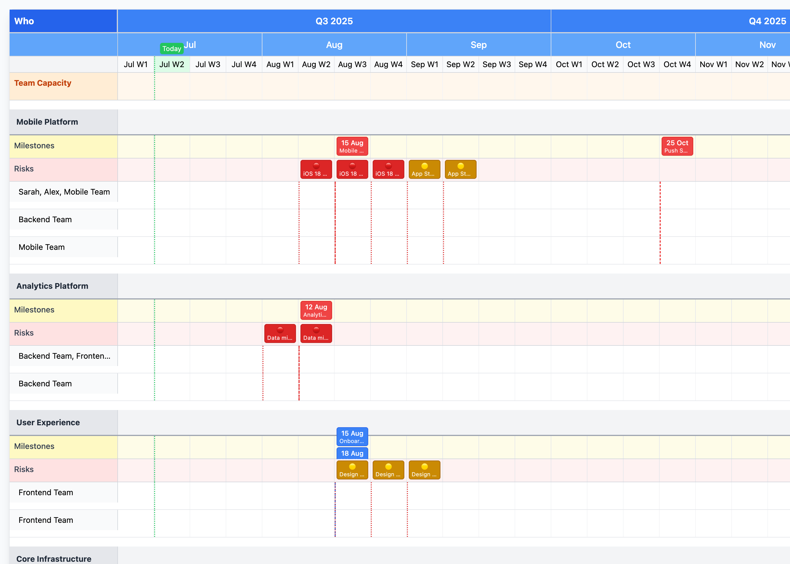

# Roadmap Planner

An interactive, open-source roadmap and capacity planning tool built with React. Visualise project timelines, team capacity, milestones, and risks in a clean, professional interface.



*Interactive roadmap showing project streams, team capacity, milestones, and risk tracking*

> **Note**: If the screenshot above doesn't display, run `pnpm screenshot` to generate it.

## ✨ Features

- **Interactive Timeline**: Pan and zoom through your roadmap
- **Team Capacity Planning**: Visualise leave, holidays, and resource constraints
- **Risk Management**: Track and display project risks with severity levels
- **Milestone Tracking**: Hard and soft deadlines with visual indicators
- **Responsive Design**: Works on desktop, tablet, and mobile
- **Export Options**: Print or save as PDF/PNG
- **Keyboard Navigation**: Full keyboard support for accessibility
- **Customizable**: Easy to modify colours, data, and layout

## 🚀 Quick Start

### Installation

```bash
# Install dependencies
pnpm install

# Start development server
pnpm dev
```

### Usage

1. **Customise the data** in `src/data/roadmap.md`
2. **Modify colours and styling** in the configuration files
3. **Add your own streams, milestones, and capacity planning**

## 📊 Data Format

The roadmap uses a simple markdown-like format:

```markdown
# Q3/Q4 2025 Product Roadmap

## Team Capacity
- **Developer Leave**: Aug W2-Aug W3 | color: #FFA500

## Streams

### Mobile Platform
- **Risk: iOS compatibility**: Aug W2-Aug W4 | risk-level: high | color: #FF4444
- **Mobile App v3.0**: Jul W1-Sep W2 | Mobile Team | hard-deadline: 2025-08-15 | deadline-label: App Release | color: #4F46E5
```

### Supported Properties

- **Timeline**: `Jul W1-Sep W2` (week ranges)
- **Teams**: Any text describing who's working on it
- **Colours**: Hex colour codes for visual differentiation
- **Deadlines**: `hard-deadline` or `soft-deadline` with ISO dates
- **Risks**: `risk-level: high|medium|low`
- **Labels**: Custom `deadline-label` for milestone annotations

## 📄 PDF Export

Generate high-quality PDFs of your roadmap for sharing and printing:

### Initial Setup (One-time)

First time using PDF export? Install Chrome for Puppeteer:

```bash
# Option 1: Allow Puppeteer build scripts (recommended)
pnpm approve-builds
# Select 'y' when prompted for puppeteer

# Option 2: Manual Chrome installation
npx puppeteer browsers install chrome
```

### Generate PDFs

```bash
# Generate standard A4 portrait PDF
pnpm pdf

# Generate landscape orientation (recommended for wide roadmaps)
pnpm pdf:landscape

# Generate A3 size for large roadmaps
pnpm pdf:a3

# Custom options
pnpm pdf --format=Letter --output=my-roadmap.pdf
pnpm pdf --landscape --format=A3 --output=quarterly-roadmap.pdf
```

### PDF Features

- **Paper Formats**: A4, A3, Letter, Legal, Tabloid
- **Orientations**: Portrait and Landscape
- **High Quality**: 2x resolution for crisp text and graphics
- **Print Optimised**: Enhanced colors, borders, and text sizing
- **Professional Layout**: Auto-generated headers with date, page numbering
- **Full Color**: All timeline colors, backgrounds, and styling preserved

### Screenshot Generation

Generate high-resolution screenshots for documentation:

```bash
# Generate screenshot for README/docs
pnpm screenshot
```

Files are saved with timestamps: `roadmap-2025-07-08T14-30-00.pdf`

## 🎮 Controls

- **Mouse**: Scroll to pan, use zoom controls
- **Keyboard**: Arrow keys to pan, Ctrl/Cmd + +/- to zoom
- **Touch**: Pinch to zoom, swipe to pan (mobile)

## 🏗️ Architecture

The project follows clean architecture principles:

```
src/
├── components/         # React UI components
├── domain/             # Business logic and parsing
├── data/               # Demo data and configuration
├── hooks/              # Custom React hooks
├── styles/             # Global CSS and Tailwind
└── test/               # Test setup and utilities
```

### Key Components

- **RoadmapPlanner**: Main orchestrating component
- **StreamContainer**: Manages individual project streams
- **TimelineHeader**: Quarter/month/week navigation
- **TeamCapacity**: Resource and availability planning
- **NavigationControls**: Zoom, export, and keyboard shortcuts

## 🧪 Testing

```bash
# Run tests
pnpm test

# Run with UI
pnpm test:ui

# Coverage report
pnpm test:coverage
```

Tests use a clean arrange/act/assert structure for maintainability.

## 🚀 Deployment

### Static Hosting (Recommended)

```bash
# Build for production
pnpm build

# Deploy to Netlify, Vercel, or GitHub Pages
```

### Docker

```dockerfile
FROM node:18-alpine
WORKDIR /app
COPY package.json pnpm-lock.yaml ./
RUN corepack enable && pnpm install --frozen-lockfile --prod
COPY . .
RUN pnpm build
EXPOSE 3000
CMD ["pnpm", "preview"]
```

## 🎨 Customisation

### Colours

Modify the colour scheme directly in your `src/data/roadmap.md` file:

```markdown
# Your Roadmap

## Streams

### Your Stream
- **Your Project**: Jul W1-Sep W2 | Your Team | color: #10B981
- **Another Project**: Aug W1-Oct W2 | Another Team | color: #EF4444
```

### Timeline Range

Update quarters directly in your `src/data/roadmap.md` file:

```markdown
# Q1/Q2 2026 Roadmap

## Streams

### Your Stream
- **Project Name**: Jan W1-Mar W4 | Team | color: #4F46E5
- **Next Project**: Apr W1-Jun W4 | Team | color: #10B981
```

### Styling

The project uses Tailwind CSS. Customise `tailwind.config.js` for your brand:

```javascript
theme: {
  extend: {
    colors: {
      'brand-primary': '#your-color',
      'brand-secondary': '#your-color',
    },
  },
},
```

## 🤝 Contributing

1. Fork the repository
2. Create a feature branch (`git checkout -b feature/amazing-feature`)
3. Follow the existing code style and testing patterns
4. Update documentation and generate screenshots if needed:
   ```bash
   # Generate updated screenshot for README
   pnpm screenshot
   ```
5. Commit your changes (`git commit -m 'feat: add amazing feature'`)
6. Push to the branch (`git push origin feature/amazing-feature`)
7. Open a Pull Request


## 📄 License

MIT License - see [LICENSE](LICENSE) file for details.

## 🙏 Acknowledgments

- Built with React and Tailwind CSS
- Inspired by modern project management tools
- Designed for simplicity and extensibility

---

## 📧 Support

- **Issues**: [GitHub Issues](https://github.com/your-username/roadmap-planner/issues)
- **Discussions**: [GitHub Discussions](https://github.com/your-username/roadmap-planner/discussions)
- **Documentation**: [Wiki](https://github.com/your-username/roadmap-planner/wiki)
